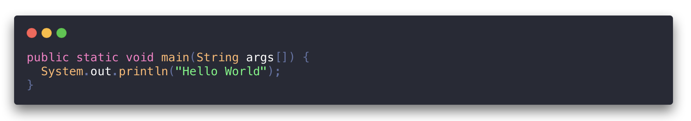
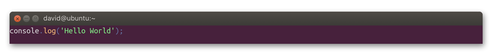
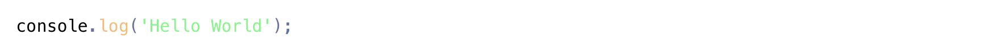

# gatsby-remark-highlight-code

Adds stylish cards and syntax highlighting to code blocks in markdown files using the [@deckdeckgo/highlight-code] Web Component.

This code highlighter is developed with [Stencil](https://stenciljs.com) and use [Prism.js](https://prismjs.com) under the hood.

The inspiration for the design of the "Macish" cards comes from the amazing [carbon](https://carbon.now.sh), a tool to create and share beautiful images of your source code, and for the "Ubuntu-ish" from the [article](https://dev.to/codypearce/ubuntu-terminal-in-css-1aeo) of [Cody Pearce](https://twitter.com/codyapearce).

Carbon:

<div align="left">
  
</div>

Ubuntu:

<div align="left">
  
</div>

None:

<div align="left">
  
</div>

## Table of contents

- [Install](#install)
- [How to use](#how-to-use)
    - [Configure](#configure)
    - [Load the component](#load-the-component)
- [Language](#language)
- [Styling](#styling)
    - [Terminal](#terminal)
    - [Variables](#variables)
- [Showcase](#showcase)
- [License](#license)

## Install

```bash
npm install --save gatsby-transformer-remark gatsby-remark-highlight-code @deckdeckgo/highlight-code
```

## How to use

In order to use this plugin, it should be first `configured` and then `loaded` at runtime.

### Configure

```javascript
// In your gatsby-config.js
plugins: [
  {
    resolve: `gatsby-transformer-remark`,
    options: {
      plugins: [
        {
          resolve: `gatsby-remark-highlight-code`
        },
      ],
    },
  },
]
```

### Load the component

[Stencil](https://stenciljs.com) components should currently be loaded at runtime (see issue [#1724](https://github.com/ionic-team/stencil/issues/1724)).

For that purpose, load the [@deckdeckgo/highlight-code] once in one of your pages or components are mounted.

For example add the following in the main file of your website, in your `index.js`, or in the template of your blog or simply load it where you need it.

#### Class component

```javascript
async componentDidMount() {
    try {
        const deckdeckgoHighlightCodeLoader = require("@deckdeckgo/highlight-code/dist/loader")
    
        await deckdeckgoHighlightCodeLoader.defineCustomElements(window);
    } catch (err) {
        console.error(err);
    }
}
```  

#### Functional component with hooks

```javascript
import React, { Fragment, useEffect } from "react";
import { defineCustomElements as deckdeckgoLoader} from '@deckdeckgo/highlight-code/dist/loader';

const yourComponent = () => {

  useEffect(() => {
    try {
      deckdeckgoLoader(window);
    } catch (err) {
      console.log(err);
    }
  }, []);

  return (
    <Fragment>
      <ComponentOne />
      <ComponentTwo />
      [...]
    </Fragment>
  )
}

export default yourComponent;
```

## Language

This plugin supports all languages supported by [Prism.js](https://prismjs.com). Nothing particular needs to be specified because the component [@deckdeckgo/highlight-code] will load them automatically at runtime.

## Styling

Code blocks are displayed in stylish cards but the behavior could be customized.

### Terminal

Per default, code blocks are going to be displayed in `carbon` ("Macish like") container.

It is also possible to use `ubuntu` (an Ubuntu-like container) or `none` (no window container).

Such settings can be provided in the configuration of the plugin.

```javascript
// In your gatsby-config.js
plugins: [
  {
    resolve: `gatsby-transformer-remark`,
    options: {
      plugins: [
        {
          resolve: `gatsby-remark-highlight-code`,
          options: {
            terminal: 'ubuntu'
          }
        },
      ],
    },
  },
]
```

### Variables

See the [@deckdeckgo/highlight-code] documentation for the list of CSS4 styling variables.

## Showcase

I (David here) use this plugin in the blog of my personal website [daviddalbusco.com](https://daviddalbusco.com).

## License

MIT © [David Dal Busco](mailto:david.dalbusco@outlook.com) and [Nicolas Mattia](mailto:nicolas@nmattia.com) 

[@deckdeckgo/highlight-code]: https://docs.deckdeckgo.com/components/code
